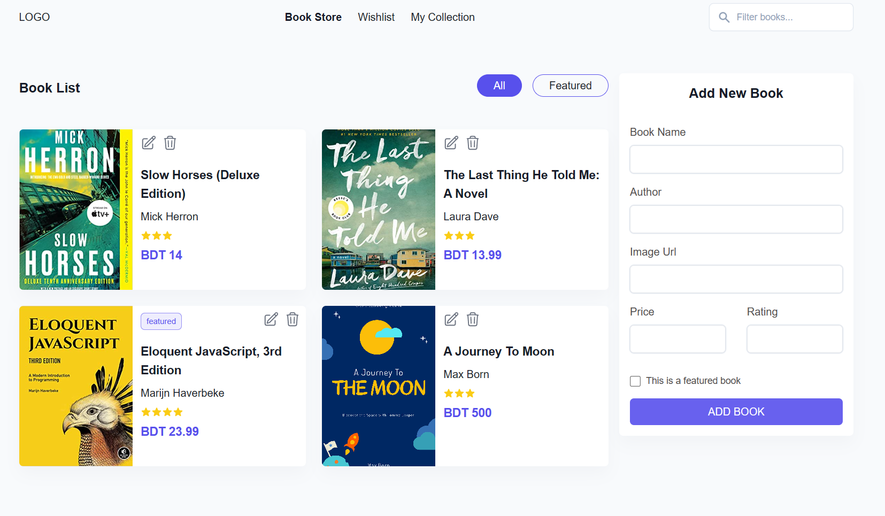

## Manage Bookstore Application State Management Using React-redux

### Live preview [Show live preview](https://lws-simplebookstore.netlify.app/)

> **Note**
> In this project the server are used is a dummy local server.To start the server you have to download the "server" folder add install node dependency (e.x npm install) then start the server (e.x npm start).

### Functionality

✓ ডান পাশে দেয়া ফর্ম এ, যাবতীয় তথ্য ইনপুট দিয়ে সাবমিট করলে, সেটি asynchronously লোকাল সার্ভারে গিয়ে Store হবে।

✓ "Book List" - এর ডানে "All, Featured নামে দুটি ট্যাগ আছে, Featured সিলেক্ট করলে 'Featured' বই গুলো শুধু ফিল্টার করে দেখাবে। All দিলে সব গুলোই দেখাবে।

✓ নেভিগেশন মেনুতে "Search Bar" - আছে, সেখানে সার্চ করলে, শুধু মাত্র বই এর নাম দিয়ে সার্চ করব, এবং সার্চ রেজাল্ট "Book List" সেকশনেই ফিল্টার হয়ে দেখাবে। সার্চ বার ফাঁকা থাকলে, স্বাভাবিক ভাবে যেমন সব বই গুলো দেখায়, সেভাবেই দেখাবে।

✓ কার্ড আইটেমের Edit আইকনে ক্লিক করলে, কার্ডের সব তথ্য ডান পাশের "Add New Book" ফর্মে চলে যাবে। বাটনের নাম তখন "Add Book" থেকে "Update Book" এ কনভার্ট হবে।

✓ "Update Book" এ ক্লিক করলে, প্রোডাক্ট আপডেট হয়ে যাবে, ফর্ম Reset হয়ে যাবে, এবং বাটনের আগের title মানে "Add Book" চলে আসবে।

✓ সব শেষে ডিলিট বাটন ক্লিক করলে, বই টি ডেটাবেজ থেকে ডিলিট হয়ে যাবে।

### Web page screenshot

#### Home page

